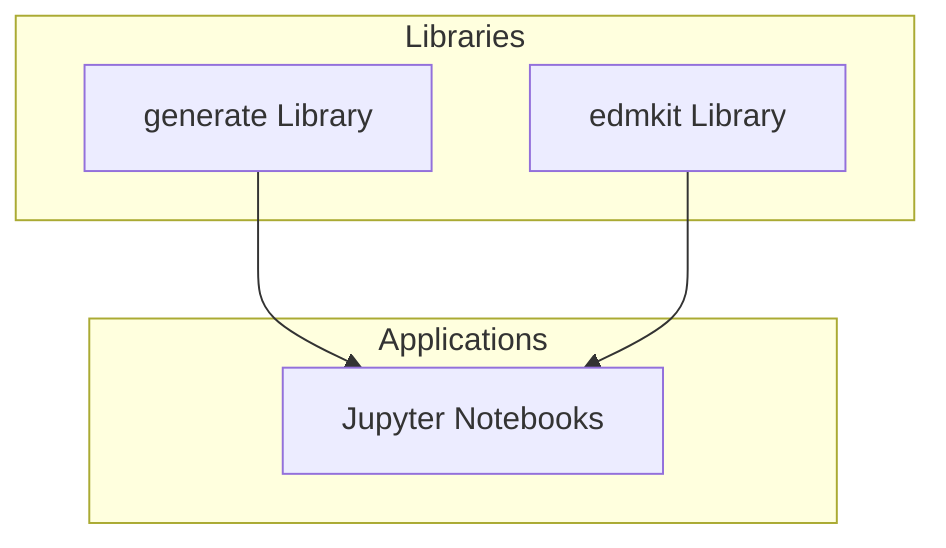

# System Patterns: CHAOS

## System Architecture

CHAOS follows a modular architecture with clear separation of concerns:



### Core Components

1. **edmkit Library**: Implements core algorithms for empirical dynamic modeling
   - Embedding techniques
   - Convergent Cross Mapping (CCM)
   - S-Map (State-dependent Model)
   - Graph-based analysis
   - Simplex projection

2. **generate Library**: Provides synthetic data generators
   - Lorenz system
   - Double pendulum
   - Mackey-Glass equation
   - Network-based systems

3. **Notebooks**: Demonstrate applications and techniques
   - Analysis workflows
   - Visualization examples
   - Algorithm demonstrations

## Key Technical Decisions

### Python Ecosystem
- Uses modern Python packaging (pyproject.toml)
- Likely relies on NumPy/SciPy for numerical operations
- Jupyter notebooks for interactive analysis

### Modular Design
- Clear separation between data generation and analysis
- Algorithms implemented as standalone modules
- Utilities separated from core algorithms

### Testing Strategy
- Unit tests for core algorithms (test_embedding.py, test_graph.py, etc.)
- Notebook-based demonstrations serve as integration tests

## Design Patterns

### Factory Pattern
- Likely used in generators to create different types of dynamical systems

### Strategy Pattern
- Different embedding strategies (time delay, etc.)
- Various graph construction algorithms

### Pipeline Pattern
- Data flows from generation → embedding → analysis → visualization

## Component Relationships

```mermaid
graph TD
    subgraph edmkit
        embedding[Embedding]
        ccm[CCM]
        smap[SMap]
        graph[Graph]
        simplex[Simplex Projection]
        util[Utilities]
        tensor[Tensor Operations]
        heap[Heap Data Structure]
    end
    
    subgraph generate
        lorenz[Lorenz System]
        pendulum[Double Pendulum]
        mackey[Mackey-Glass]
        network[Network Generator]
    end
    
    %% Dependencies
    embedding --> util
    ccm --> embedding
    smap --> embedding
    graph --> util
    simplex --> util
    simplex --> heap
    
    %% Usage in notebooks
    generate --> notebooks
    edmkit --> notebooks
```

## Data Flow

1. **Data Generation/Import**
   - Generate synthetic data from known systems
   - Import real-world time series data

2. **Preprocessing**
   - Embedding into phase space
   - Normalization and filtering

3. **Analysis**
   - Apply CCM, SMap, or other algorithms
   - Construct and analyze graphs

4. **Visualization**
   - Plot results
   - Generate network visualizations

## Extension Points

The system appears designed for extensibility in several areas:

1. **New Generators**
   - Additional dynamical systems can be added to the generate library

2. **New Analysis Techniques**
   - Additional algorithms can be implemented in edmkit

3. **New Applications**
   - Additional notebooks can demonstrate new use cases

## Technical Constraints

1. **Computational Efficiency**
   - Some algorithms may have high computational complexity
   - May require optimization for large datasets

2. **Numerical Stability**
   - Chaotic systems are sensitive to initial conditions
   - Numerical precision is likely important

3. **Visualization Limitations**
   - Complex high-dimensional data may be challenging to visualize effectively